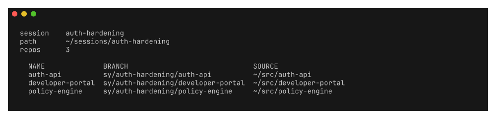

# seshy

Minimalist session manager for multi-repo development, with git worktree integration.




## Install

```bash
nix run github:roshbhatia/seshy -- --help
```

Install with Homebrew:

```bash
brew install roshbhatia/tap/seshy
```

Or install with Nix:

```bash
nix profile install github:roshbhatia/seshy
```

Tagged releases publish `sy` archives for Darwin and Linux on ARM64 and x86-64.
Each package includes Bash, Zsh, Fish, and Nushell completions.

Enable directory-changing wrappers separately for Bash, Zsh, or Fish:

```bash
eval "$(sy init zsh)" # use bash for Bash
sy init fish | source
```

Nushell uses one surface for both completion and directory changes. Nix and
Homebrew install it automatically. For a manual installation, run:

```nu
sy completion nu | save --force ~/.config/nushell/vendor/autoload/sy.nu
```

Commands and aliases take priority over conflicting session names. Use
`sy --greedy <name>` to resolve such a session explicitly.

## Commands
<!-- BEGIN GENERATED:commands -->

### `sy`

sy [flags]

| Option | Description |
| --- | --- |
| `--greedy` `<value>` | Fuzzy-match a session name and print its path |

### `sy add`

sy add <name> [repos...] [flags]

| Option | Description |
| --- | --- |
| `--branch`, `-b` `<value>` | Override branch name for all worktrees |
| `--stdin` | Read repo paths from stdin |

### `sy archive`

sy archive [name]

Move a session into the archive.

Archiving keeps worktrees, branches, and uncommitted work intact. It only moves
the session out of the way. Archived sessions no longer appear in "sy list".

List them with "sy list --archived". Restore one with "sy unarchive <name>".
Archiving does not prompt for confirmation, because nothing is destroyed.

### `sy attach`

sy attach <name>

Print the resolved session as JSON, for a multiplexer to act on.

seshy cannot attach anything itself: a wezterm workspace switch happens inside
wezterm, and a tmux one inside tmux. So this resolves the name and reports what
the caller needs, and the caller performs the switch. That keeps one matcher and
one source of session names behind every UI.

### `sy completion`

sy completion <bash|zsh|fish|nu>

### `sy config`

sy config

### `sy config edit`

sy config edit

### `sy config init`

sy config init

### `sy current`

sy current [flags]

Print the session that holds the working directory.

Nothing records an "active session", so this resolves it from the working
directory. Use it from a prompt, a status line or a pane widget instead of
each one re-deriving the answer from a path.

Exits non-zero when the working directory is outside every session.

| Option | Description |
| --- | --- |
| `--path` | Print the session path instead of its name |
| `--quiet`, `-q` | Print nothing when outside a session |

### `sy delete`

sy delete [name] [flags]

| Option | Description |
| --- | --- |
| `--archived` | Delete an archived session instead of an active one |
| `--force`, `-f` | Skip confirmation and delete even if worktree cleanup fails |

### `sy help`

sy help [command]

Help provides help for any command in the application.
Simply type sy help [path to command] for full details.

### `sy init`

sy init <shell>

Print shell integration code for your shell.

Add to your shell config:
  eval "$(sy init zsh)"   # zsh
  eval "$(sy init bash)"  # bash
  sy init fish | source   # fish
  sy init nu | save --force ~/.config/nushell/vendor/autoload/sy.nu

With shell integration active, "sy <name>" will cd into the session directory
using greedy matching. Commands and aliases always run as commands. Use
"sy --greedy <name>" to resolve a session whose name conflicts with one.

### `sy list`

sy list [flags]

| Option | Description |
| --- | --- |
| `--archived` | List archived sessions instead of active ones |
| `--json` | Output JSON |
| `--names` | Output session names only |
| `--paths` | Output session paths only |

### `sy new`

sy new <name> [repos...] [flags]

| Option | Description |
| --- | --- |
| `--branch`, `-b` `<value>` | Override branch name for all worktrees |
| `--empty` | Create the session with no repositories |
| `--stdin` | Read repo paths from stdin |

### `sy path`

sy path <name>

### `sy remove`

sy remove <session> <repo> [flags]

| Option | Description |
| --- | --- |
| `--force`, `-f` | Skip confirmation prompt |

### `sy rename`

sy rename <old-name> <new-name>

### `sy status`

sy status [name]

### `sy switch`

sy switch <name> [flags]

Resolve a session by fuzzy name and print its path.

A process cannot change its parent shell's directory, so this prints the path
and the shell integration from "sy init" does the cd. The name is matched
exactly, then by prefix, then by substring.

| Option | Description |
| --- | --- |
| `--name` | Print the resolved name instead of the path |

### `sy unarchive`

sy unarchive [name]

Restore an archived session back into the sessions directory.

Unarchiving does not prompt for confirmation, because nothing is destroyed.

<!-- END GENERATED:commands -->

## Configuration

Config lives at `~/.config/seshy/config.yaml`, or
`$XDG_CONFIG_HOME/seshy/config.yaml`. Set `SESHY_CONFIG` to select another
file. Unknown YAML fields fail fast. The generated schema supports editor
completion:

```yaml
# yaml-language-server: $schema=https://raw.githubusercontent.com/roshbhatia/seshy/main/schema/config.schema.json
# Branch naming template. Variables: {{.Session}}, {{.Repo}}, {{.User}}
branchFormat: "sy/{{.Session}}/{{.Repo}}"

# Sessions storage directory
sessionsDir: "~/.local/state/seshy/sessions"

# Archive storage directory. Defaults to a sibling of sessionsDir, so archiving
# stays a same-filesystem move.
archiveDir: "~/.local/state/seshy/archive"
```

Run `sy config` to see effective settings, `sy config edit` to modify.

Every field also has an environment override. Nested fields use underscores.
For example:

```bash
export SESHY_BRANCH_FORMAT='work/{{.Session}}/{{.Repo}}'
export SESHY_SESSIONS_DIR="$HOME/work/sessions"
export SESHY_HOOKS_POST_CREATE='["direnv allow"]'
```

## Archiving

Archiving moves a session out of the way without tearing it down. Worktrees,
branches, and uncommitted work all survive the move, and the main repos are
repaired so they track the new location.

```bash
sy archive my-feature      # move it to ~/.local/state/seshy/archive
sy list --archived         # see what is archived
sy unarchive my-feature    # move it back
```

Neither command prompts for confirmation, because neither destroys anything.
Archived sessions do not appear in `sy list`. To throw one away for good, run
`sy delete --archived <name>`.

## Empty Sessions

A session does not need any repositories. Use `--empty` to create one with none:

```bash
sy new scratch --empty
sy add scratch          # attach repos later
```

Two other paths create an empty session instead of prompting:

- `sy new <name> --stdin` when stdin holds no paths.
- `sy new <name>` when the repo source returns no candidates.

Non-git directories are always supported. Seshy symlinks them into the session
instead of creating a worktree, and `sy status` marks them `(symlink)`.

## Branch Naming

By default, worktree branches are named `sy/<session>/<repo>`. Override per-invocation:

```bash
sy new my-feature --branch hotfix/urgent
sy add my-feature -b feature/custom-branch
```

Or set a custom template in config:

```yaml
branchFormat: "dev/{{.User}}/{{.Session}}/{{.Repo}}"
```
