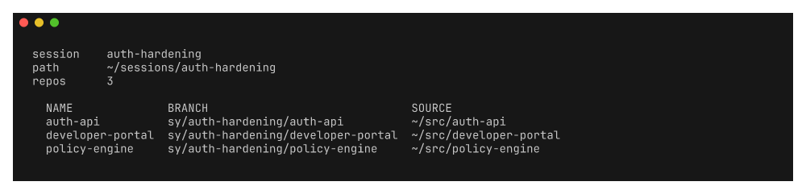

# seshy

Minimalist session manager for multi-repo development, with git worktree integration.




The recording reviews real [Changes](https://github.com/roshbhatia/changes/commit/72449fa57f2813300968e042952126f9fc32e045) and [Ask](https://github.com/roshbhatia/ask/commit/d6bd2d4cd84aad5d677b33f229bb35124e9ca725) commits in one session.
It creates isolated worktrees, inspects release history, then archives and restores the group.
[Recording script](hack/screenshots.sh) · [Tape](hack/seshy.tape)

[Worktree ownership, harness integration, and storage](docs/worktree-lifecycle.md)

## Install

```bash
nix run github:roshbhatia/seshy -- --help
```

Install with Homebrew:

```bash
brew install roshbhatia/tap/seshy
```

Or install with Nix:

```bash
nix profile install github:roshbhatia/seshy
```

Tagged releases publish `sy` archives for Darwin and Linux on ARM64 and x86-64.
Each package includes Bash, Zsh, Fish, and Nushell completions.

Enable directory-changing wrappers separately for Bash, Zsh, or Fish:

```bash
eval "$(sy init zsh)" # use bash for Bash
sy init fish | source
```

Nushell uses one surface for both completion and directory changes. Nix and
Homebrew install it automatically. For a manual installation, run:

```nu
sy completion nu | save --force ~/.config/nushell/vendor/autoload/sy.nu
```

Commands and aliases take priority over conflicting session names. Use
`sy --greedy <name>` to resolve such a session explicitly.

## Commands
<!-- BEGIN GENERATED:commands -->

### `sy`

sy [flags]

| Option | Description |
| --- | --- |
| `--config` `<value>` | Config file, instead of $SESHY_CONFIG or $XDG_CONFIG_HOME/seshy/config.yaml |
| `--greedy` `<value>` | Fuzzy-match a session name and print its path |

### `sy add`

sy add <name> [repos...] [flags]

| Option | Description |
| --- | --- |
| `--branch`, `-b` `<value>` | Override branch name for all worktrees |
| `--existing` | Check out the existing branch named by --branch |
| `--reference` | Link existing directories without creating worktrees |
| `--sparse-directory` `<value>` | Check out only this directory and root files (repeatable) |
| `--start-point` `<value>` | Commit to start a new branch from (default HEAD) |
| `--stdin` | Read repo paths from stdin |

### `sy archive`

sy archive [name]

Move a session into the archive.

Archiving keeps worktrees, branches, and uncommitted work intact. It only moves
the session out of the way. Archived sessions no longer appear in "sy list".

List them with "sy list --archived". Restore one with "sy unarchive <name>".
Archiving does not prompt for confirmation, because nothing is destroyed.

### `sy attach`

sy attach <name>

Print the resolved session as JSON, for a multiplexer to act on.

seshy cannot attach anything itself: a wezterm workspace switch happens inside
wezterm, and a tmux one inside tmux. So this resolves the name and reports what
the caller needs, and the caller performs the switch. That keeps one matcher and
one source of session names behind every UI.

### `sy completion`

sy completion <bash|zsh|fish|nu>

### `sy config`

sy config

Show the effective configuration with the origin of each value.

Origin is one of env, file, or default, in that precedence. branchFormat is
additionally overridable per source repo through git config seshy.branchFormat,
which this global view does not read.

### `sy config edit`

sy config edit

### `sy config init`

sy config init

### `sy current`

sy current [flags]

Print the session that holds the working directory.

Nothing records an "active session", so this resolves it from the working
directory. Use it from a prompt, a status line or a pane widget instead of
each one re-deriving the answer from a path.

Exits non-zero when the working directory is outside every session.

| Option | Description |
| --- | --- |
| `--path` | Print the session path instead of its name |
| `--quiet`, `-q` | Print nothing when outside a session |

### `sy delete`

sy delete [name] [flags]

| Option | Description |
| --- | --- |
| `--archived` | Delete an archived session instead of an active one |
| `--force`, `-f` | Skip confirmation and delete even if worktree cleanup fails |
| `--yes`, `-y` | Skip the confirmation prompt |

### `sy help`

sy help [command]

Help provides help for any command in the application.
Simply type sy help [path to command] for full details.

### `sy init`

sy init <shell>

Print shell integration code for your shell.

Add to your shell config:
  eval "$(sy init zsh)"   # zsh
  eval "$(sy init bash)"  # bash
  sy init fish | source   # fish
  sy init nu | save --force ~/.config/nushell/vendor/autoload/sy.nu

With shell integration active, "sy <name>" will cd into the session directory
using greedy matching. Commands and aliases always run as commands. Use
"sy --greedy <name>" to resolve a session whose name conflicts with one.

### `sy list`

sy list [flags]

| Option | Description |
| --- | --- |
| `--archived` | List archived sessions instead of active ones |
| `--format` `<value>` | Output format: table, json, names, paths |
| `--json` | Output JSON |
| `--names` | Output session names only |
| `--paths` | Output session paths only |

### `sy new`

sy new <name> [repos...] [flags]

| Option | Description |
| --- | --- |
| `--branch`, `-b` `<value>` | Override branch name for all worktrees |
| `--empty` | Create the session with no repositories |
| `--existing` | Check out the existing branch named by --branch |
| `--reference` | Link existing directories without creating worktrees |
| `--sparse-directory` `<value>` | Check out only this directory and root files (repeatable) |
| `--start-point` `<value>` | Commit to start a new branch from (default HEAD) |
| `--stdin` | Read repo paths from stdin |

### `sy open`

sy open <name> [flags]

Print the session directory, or with --format json the seshy.open/v1 plan a
launcher runs to enter the session: its cwd, an empty command for the caller's
default program, and SESHY_SESSION in the environment.

The name is matched exactly, or given as the seshy:<name> id a listing
printed. A session that no longer exists exits 3.

| Option | Description |
| --- | --- |
| `--format` `<value>` | Output format: table, json |

### `sy path`

sy path <name>

### `sy provider`

sy provider

Answer one provider/v1 request frame read from stdin, as roster invokes it.

The frame's capability selects the answer: provider.validate reports ok,
source.list returns the roster.catalog/v1 document, and source.open takes
{"id": "seshy:<name>"} and returns that row with its spawn plan. The result is
one JSON line on stdout. A capability seshy does not implement, or an id that
names no session, is an error result, not a non-zero exit; a frame that is
not a provider/v1 request is a usage error.

The manifest roster discovers is share/seshy/providers/seshy.yaml.

### `sy prune`

sy prune [repo...] [flags]

Reclaim what a removed session left in git.

For each repo, prune worktree registrations whose directories are gone, then
delete the seshy branches whose session directory no longer exists. Also
remove symlinks under the sessions root whose targets are gone. With no repo
arguments, prune visits every source repo of every session. A "-" argument
reads repo paths from stdin.

Each action prints one line to stderr. --dry-run prints the actions without
taking them.

| Option | Description |
| --- | --- |
| `--dry-run` | Print the actions without taking them |
| `--metadata-only` | Prune only expired Git registrations; preserve branches and references |

### `sy remove`

sy remove <session> <repo> [flags]

| Option | Description |
| --- | --- |
| `--force`, `-f` | Skip confirmation prompt and remove even if worktree cleanup fails |
| `--yes`, `-y` | Skip the confirmation prompt |

### `sy rename`

sy rename <old-name> <new-name>

### `sy source`

sy source

Serve sessions to roster, the session-source aggregator a launcher reads.

"sy source list" prints the roster.catalog/v1 document directly, one row per
active session, for inspection. roster itself talks to "sy provider".

### `sy source list`

sy source list

### `sy status`

sy status [name] [flags]

| Option | Description |
| --- | --- |
| `--format` `<value>` | Output format: table, json |

### `sy switch`

sy switch <name> [flags]

Resolve a session by fuzzy name and print its path.

A process cannot change its parent shell's directory, so this prints the path
and the shell integration from "sy init" does the cd. The name is matched
exactly, then by prefix, then by substring.

| Option | Description |
| --- | --- |
| `--name` | Print the resolved name instead of the path |

### `sy unarchive`

sy unarchive [name]

Restore an archived session back into the sessions directory.

Unarchiving does not prompt for confirmation, because nothing is destroyed.

### `sy worktrees`

sy worktrees [repo...] [flags]

Inventory Git registrations without moving or adopting worktrees.

Without repo arguments, inspect the current repository and repositories linked
from active and archived sessions. Explicit arguments restrict that scope.
Git's common directory deduplicates linked checkouts from any harness.

--disk-usage measures allocated bytes without following symlinks. Shared Git
storage is separate; registered nested worktrees are excluded from their parent's
checkout size. APFS clones and hardlinks across checkouts can still share blocks.
This scan is opt-in because build and dependency directories can be large.

Status includes untracked files, but excludes ignored files. Ahead/behind uses
local upstream refs and does not fetch. Cautions are a review preview, never
permission to delete: active processes and harness retention are not checked.

| Option | Description |
| --- | --- |
| `--disk-usage` | Measure shared Git and checkout allocated bytes |
| `--format` `<value>` | Output format: table, json |

<!-- END GENERATED:commands -->

## Plumbing and porcelain

seshy has two kinds of command. Porcelain is for a person at a terminal;
plumbing is for another program.

Porcelain reads the terminal, prompts, and prints a table. The bare `sy`
picker and the `s` and `sz` shell wrappers from `sy init` are porcelain: they
resolve a name, change the directory, or open a picker.

Plumbing prints one stable document and never prompts. It is versioned, so a
caller pins the shape it parses:

| Command | Output |
| --- | --- |
| `sy list --format json` | `seshy.list/v1`, a bare array; schema `schema/list.v1.schema.json` |
| `sy open <name> --format json` | `seshy.open/v1`; schema `schema/open.v1.schema.json` |
| `sy status <name> --format json` | `seshy.status/v1`; schema `schema/status.v1.schema.json` |
| `sy source list` | `roster.catalog/v1`; schema `schema/roster.catalog.v1.schema.json` |
| `sy provider` | one `provider/v1` result frame; manifest `share/seshy/providers/seshy.yaml` |

## Exit status

Scripts branch on the exit status:

| Status | Meaning |
| --- | --- |
| 0 | success |
| 1 | failure |
| 2 | usage error |
| 3 | session, repo, or archive entry not found |
| 4 | refused: a confirmation seshy could not ask for, or was answered no |
| 128 | git failed; git's own message follows `fatal:` |

## Configuration

Config lives at `~/.config/seshy/config.yaml`, or
`$XDG_CONFIG_HOME/seshy/config.yaml`. Set `SESHY_CONFIG` to select another
file. Unknown YAML fields fail fast. The generated schema supports editor
completion:

```yaml
# yaml-language-server: $schema=https://raw.githubusercontent.com/roshbhatia/seshy/main/schema/config.schema.json
# Branch naming template. Variables: {{.Session}}, {{.Repo}}, {{.User}}
branchFormat: "sy/{{.Session}}/{{.Repo}}"

# Sessions storage directory
sessionsDir: "~/.local/state/seshy/sessions"

# Archive storage directory. Defaults to a sibling of sessionsDir, so archiving
# stays a same-filesystem move.
archiveDir: "~/.local/state/seshy/archive"
```

Run `sy config` to see effective settings, `sy config edit` to modify.

Every field also has an environment override. Nested fields use underscores.
For example:

```bash
export SESHY_BRANCH_FORMAT='work/{{.Session}}/{{.Repo}}'
export SESHY_SESSIONS_DIR="$HOME/work/sessions"
export SESHY_HOOKS_POST_CREATE='["direnv allow"]'
```

## Archiving

Archiving moves a session out of the way without tearing it down. Worktrees,
branches, and uncommitted work all survive the move, and the main repos are
repaired so they track the new location.

```bash
sy archive my-feature      # move it to ~/.local/state/seshy/archive
sy list --archived         # see what is archived
sy unarchive my-feature    # move it back
```

Neither command prompts for confirmation, because neither destroys anything.
Archived sessions do not appear in `sy list`. To throw one away for good, run
`sy delete --archived <name>`.

## Empty Sessions

A session does not need any repositories. Use `--empty` to create one with none:

```bash
sy new scratch --empty
sy add scratch          # attach repos later
```

Two other paths create an empty session instead of prompting:

- `sy new <name> --stdin` when stdin holds no paths.
- `sy new <name>` when the repo source returns no candidates.

Non-git directories are always supported. Seshy symlinks them into the session
instead of creating a worktree, and `sy status` marks them `(symlink)`.

Use `sy add <group> --reference <directory>` to include an existing checkout without creating a branch.
Removing that member removes only the link.

`sy delete` and `sy remove` retain branches and refuse dirty worktrees unless `--force` is explicit.
`sy prune` uses Git's merged-branch check and refuses unmerged branches.
Use Git directly for branch deletion.

New branches start at `HEAD`, or at the commit supplied through `--start-point`.
Use `--existing --branch <name>` to select an existing branch.
Without `--existing`, an existing branch name is an error.

## Branch Naming

By default, worktree branches are named `sy/<session>/<repo>`. Override per-invocation:

```bash
sy new my-feature --branch hotfix/urgent
sy add my-feature -b feature/custom-branch
```

Or set a custom template in config:

```yaml
branchFormat: "dev/{{.User}}/{{.Session}}/{{.Repo}}"
```
